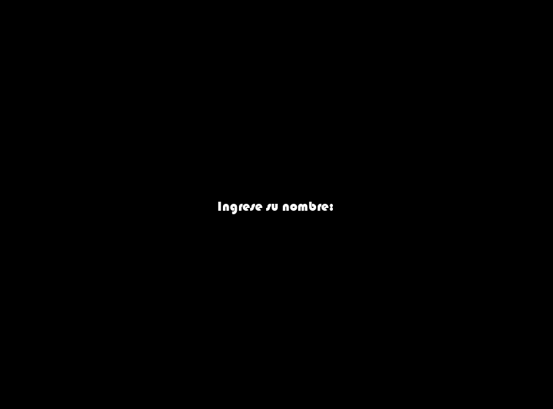
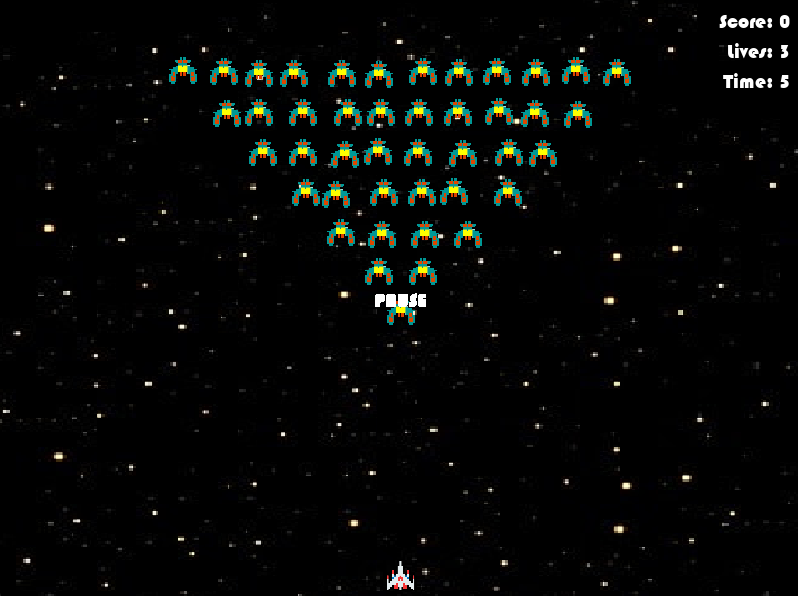
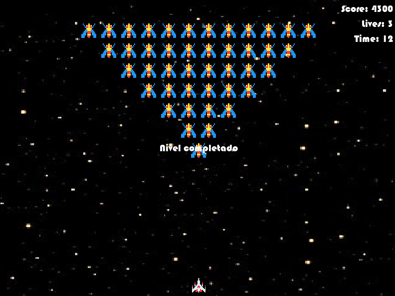
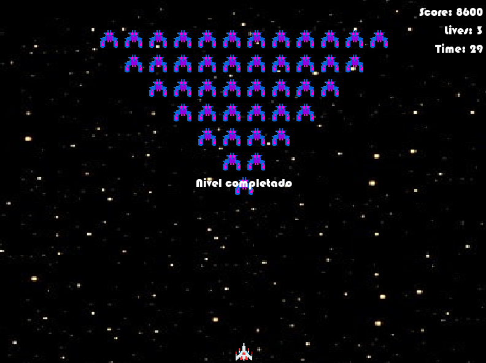
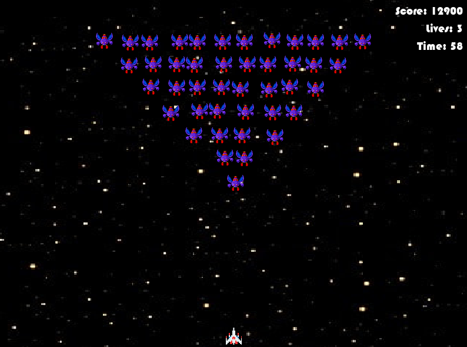
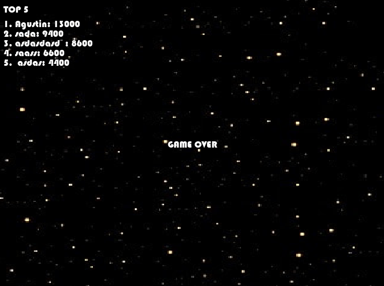

# Galaga Clone 🎮

Proyecto académico inspirado en el clásico **Galaga**, desarrollado en **Python 3.13** con **Pygame 2.6.1**.  
Incluye mecánicas de disparo, enemigos con distintos patrones de movimiento y sistema de puntuaciones.

---

## 🚀 Características
- Jugador controlable con disparos.
- Enemigos con diferentes sprites y velocidades según el nivel.
- Música de fondo y efectos de sonido.
- Sistema de puntuaciones persistente con **SQLite (`scores.db`)**.
- Escalado de dificultad por etapas.

---

## 📂 Estructura del proyecto
      
2pp_labo1/
│── galaga_main/ 
│   ├── assets/
│   │   ├── images/        # Sprites del jugador y 
│   │   └── sounds/        # Música y efectos 
│   ├── src/ 
│   │   ├── galaga.py      # Archivo principal del juego 
│   │   ├── player.py      # Lógica del jugador 
│   │   ├── enemy.py       # Lógica de enemigos 
│   │   ├── load_images.py # Funciones de carga de imágenes 
│   │   └── biblioteca_parcial.py # Funciones auxiliares 
│   └── scores.db          # Base de datos de puntuaciones 
└── README.md

---
## 📸 Capturas de pantalla
*(Se irán mejorando con fondos y estilos más atractivos)*

### Pantalla de inicio




### Gameplay






### Final



## 🎮 Controles
- Flechas ← → : mover jugador
- Barra espaciadora : disparar
- P : pausar
- ESC : salir

## ⚙️ Requisitos
- Python 3.13+
- Pygame 2.6.1

Instalación de dependencias:
```bash
pip install pygame

