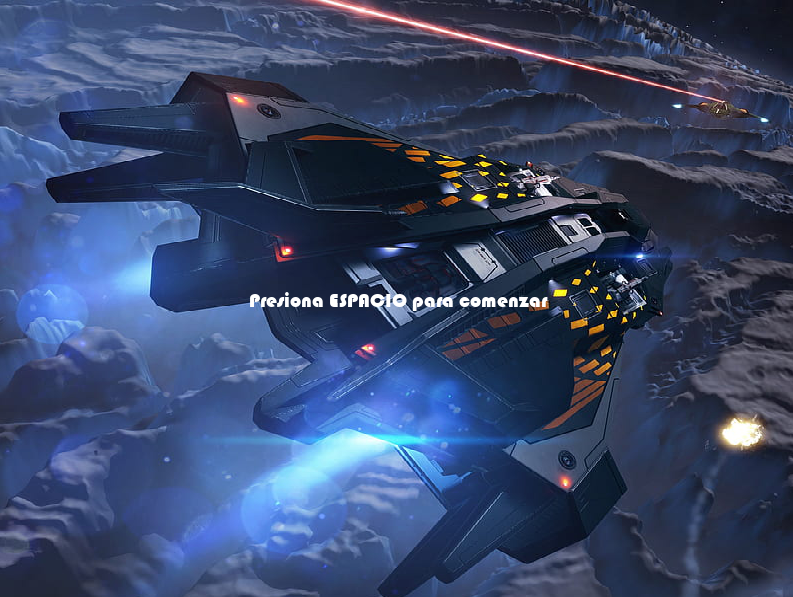
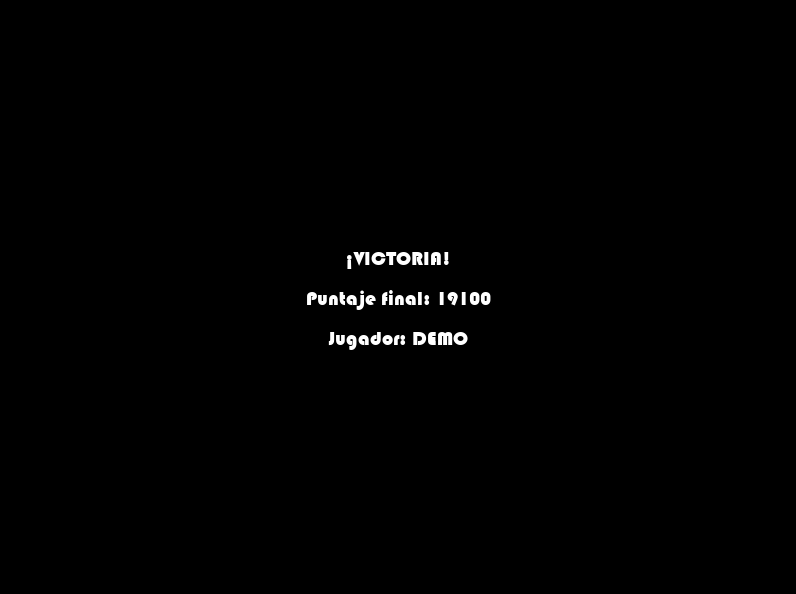

# Galaga Clone 🎮

Proyecto en el clásico **Galaga**, desarrollado en **Python 3.13** con **Pygame 2.6.1**.  
Incluye mecánicas de disparo, enemigos con distintos patrones de movimiento y sistema de puntuaciones.

---

## 🚀 Características
- Nave controlable con disparos.
- Enemigos con diferentes patrones de ataque y velocidades según el nivel.
- Música de fondo y efectos de sonido.
- Sistema de puntuación dinámico con **SQLite (`scores.db`)**.
 > Los puntajes actuales están calibrados para demostraciones y capturas, con el objetivo de mostrar el funcionamiento del sistema de guardado.
- Escalado de dificultad por etapas, dificultad calibrada para demostraciones y capturas.

---

## 📸 Capturas de pantalla
*(Se irán mejorando con fondos y estilos más atractivos)*

### Pantalla de inicio

### Login
 

### Inicio


### Gameplay

### Nivel 1


### Nivel 2


### Nivel 3


### Nivel 4


### Game Over


### Victoria


---

## 🎮 Controles
- Flechas ← → : mover jugador
- Barra espaciadora : disparar
- P : pausar
- ESC : salir
> ⚠️ Este apartado está en desarrollo: se irán incorporando nuevas mecánicas, mejoras en la jugabilidad y controles adicionales en futuras versiones.

---

## ⚙️ Requisitos
- Python 3.13+
- Pygame 2.6.1

---

## 📦 Instalación

Para instalar las librerías necesarias, asegurate de tener **Python 3.13+** y luego ejecutá:

```bash
git clone https://github.com/AgustinRodr/galaga_python.git
cd galaga_python
pip install -r requirements.txt

